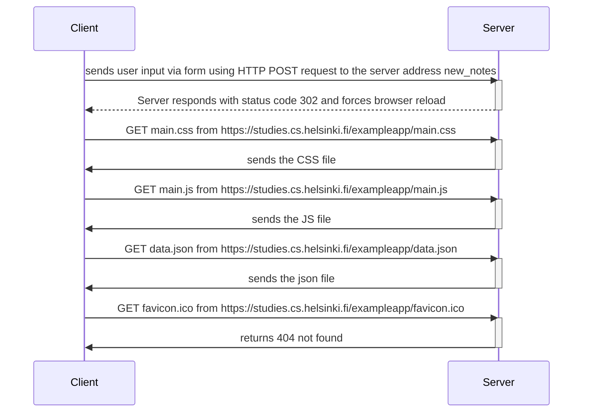

```mermaid
sequenceDiagram
    participant Client
    participant Server

    Client->>Server: sends user input via form using HTTP POST request to the server address new_notes
    activate Server

    Server-->>Client: Server responds with status code 302 and forces browser reload
    deactivate Server

    Client->>Server: GET main.css from https://studies.cs.helsinki.fi/exampleapp/main.css
    activate Server

    Server->>Client: sends the CSS file
    deactivate Server

    Client->>Server: GET main.js from https://studies.cs.helsinki.fi/exampleapp/main.js
    activate Server

    Server->>Client: sends the JS file
    deactivate Server

    Client->>Server: GET data.json from https://studies.cs.helsinki.fi/exampleapp/data.json
    activate Server

    Server->>Client: sends the json file
    deactivate Server

    Client->>Server: GET favicon.ico from https://studies.cs.helsinki.fi/exampleapp/favicon.ico
    activate Server

    Server->>Client: returns 404 not found
    deactivate Server
```
